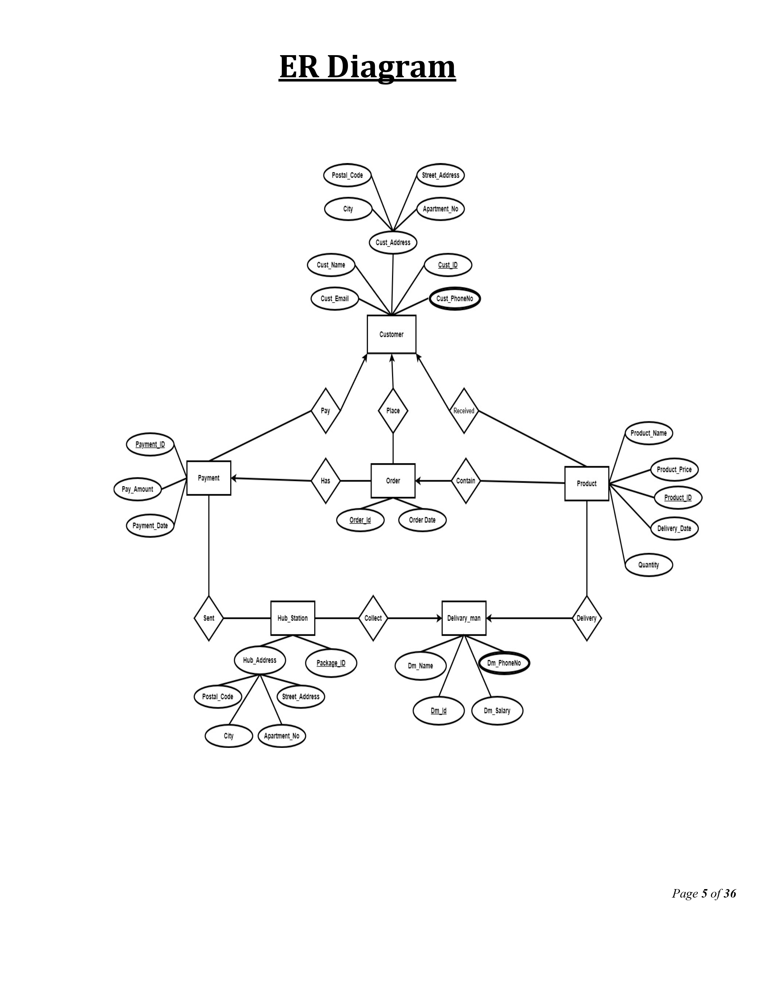
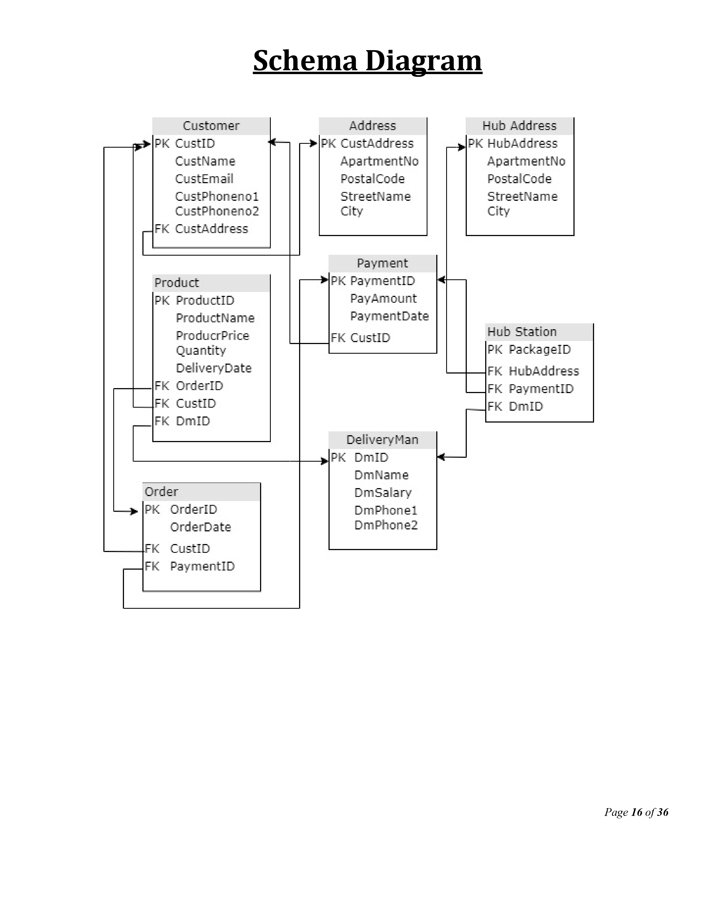

# Parcel Delivery Management System

## Overview
This project is a SQL-based **Parcel Delivery Management System** developed for the *Introduction to Database* course at the American International University-Bangladesh (AIUB), Faculty of Science & Technology, Fall 2022-2023 semester. The system streamlines parcel delivery operations, ensuring timely and accurate delivery while minimizing human effort and errors. It is implemented using Oracle 10g.

The system manages entities such as customers, orders, products, payments, delivery personnel, and hub stations, with a focus on data normalization, relational integrity, and efficient querying.

## Features
- **Database Structure**: Normalized to 3NF to ensure data integrity and eliminate redundancy.
- **Entities and Relationships**: Manages customers, orders, products, payments, delivery personnel, and hub stations with defined relationships.
- **SQL Implementation**:
  - Table creation with primary and foreign key constraints.
  - Sequence generation for auto-incrementing IDs.
  - Sample data insertion.
  - Queries including single-row functions, group functions, subqueries, joins, views, and relational algebra.
- **Diagrams**:
  - Entity-Relationship Diagram (ERD) for visualizing relationships.
  - Schema Diagram for database structure.
- **Error-Free Delivery**: Emphasizes accurate delivery with electronic payment integration.

## Database Schema
The final database includes:
1. **Customer**: Stores customer details (ID, name, email, phone numbers, address).
2. **Address**: Customer address details (apartment number, street, postal code, city).
3. **Orders**: Order details (ID, date, customer ID, payment ID).
4. **Product**: Product details (ID, name, price, quantity, delivery date, order ID, customer ID, deliveryman ID).
5. **Payment**: Payment details (ID, amount, date, customer ID).
6. **HubAddress**: Hub station address details.
7. **HubStation**: Package tracking at hub stations (package ID, hub address, payment ID, deliveryman ID).
8. **DeliveryMan**: Delivery personnel details (ID, name, salary, phone numbers).

### ER Diagram



### Schema Diagram


*Note*: To add the schema diagram, export the diagram from page 16 of the PDF, save it as `schema_diagram.png` in the `screenshots/` folder, and update the path above.

## Installation and Setup
1. **Prerequisites**:
   - Oracle 10g or compatible SQL database system.
   - SQL client (e.g., Oracle SQL Developer, Oracle Application Express).
2. **Steps**:
   ```bash
   git clone <repository-url>
